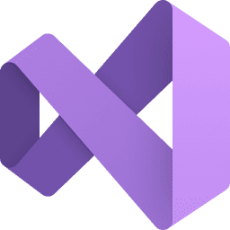
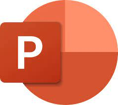
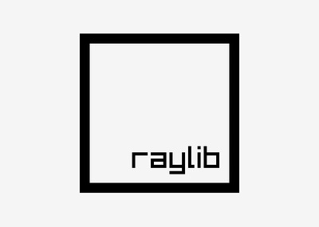

<h1 align="center"> Data Pirates </h1>
<h3 align="center"> Explore. Dream. Discover. </h3>  

<!-- TABLE OF CONTENTS -->
<h2 id="table-of-contents">Table of Contents</h2>

  
Table of Contents

  <ol>
    <li><a href="#about-the-project"> ➤ About The Project</a></li>
    <li><a href="#used-technologies"> ➤ Used Technologies</a></li>
    <li><a href="#contributors"> ➤ Contributors</a></li>
  </ol>

<!-- ABOUT THE PROJECT -->
<h2 id="about-the-project">About The Project</h2>

  This is an adventurous game about a man living alone on an island trying to survive. The player must do specific tasks to proceed to the next level. Tasks include collecting and crafting materials.

##  Used technologies
-  Visual studio 2022
-   Word
-  PowerPoint
-  Raylib
- 👩🏻‍💻 Programing languages: C++, JavaScript

<!-- CONTRIBUTORS -->
<h2 id="contributors">Contributors</h2>

  <b>Nikolai Dimitrov(Scrum Trainer)</b>  
  &nbsp;&nbsp;&nbsp;&nbsp;&nbsp; Email: <a>NDDimitrov19@codingburgas.bg</a>  

  <b>Egor Semenov(Quality Assurance)</b>  
  &nbsp;&nbsp;&nbsp;&nbsp;&nbsp; Email: <a>EDSemenov19@codingburgas.bg</a>  

  <b>Mihail Petrov(Back-End Game Developer)</b>  
  &nbsp;&nbsp;&nbsp;&nbsp;&nbsp; Email: <a>MMPetrov20@codingburgas.bg</a>  

  <b>Daniil Chebotarev(Front-End Game Developer)</b>  
  &nbsp;&nbsp;&nbsp;&nbsp;&nbsp; Email: <a>DSChebotarev20@codingburgas.bg</a>  

  <b>Gabriel Dimitrov(Back-End Web Developer)</b>  
  &nbsp;&nbsp;&nbsp;&nbsp;&nbsp; Email: <a>GGDimitrov21@codingburgas.bg</a>  

  <b>Georgi Ivanov(Front-End Web Developer)</b>  
  &nbsp;&nbsp;&nbsp;&nbsp;&nbsp; Email: <a>GNIvanov21@codingburgas.bg</a>  

  <b>Bozhidar Dimov(Front-End Web Developer)</b>  
  &nbsp;&nbsp;&nbsp;&nbsp;&nbsp; Email: <a>BADimov21@codingburgas.bg</a>  

